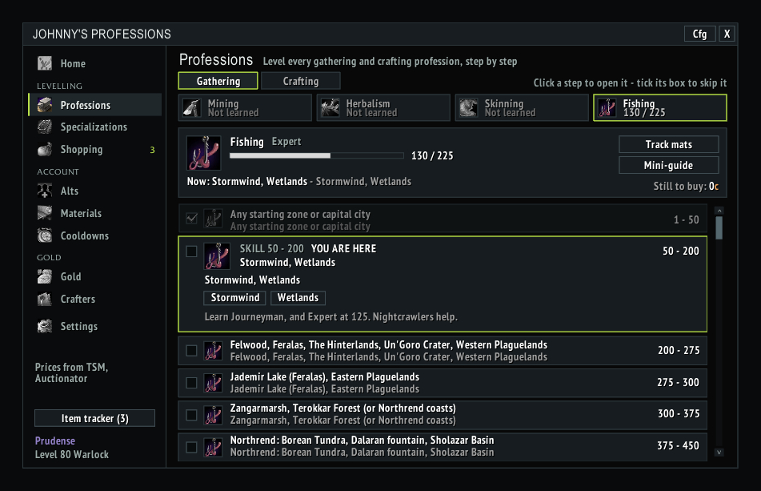

# Johnny's Professions

A World of Warcraft 3.3.5a addon for the Warmane private server.

An all-in-one profession companion in the spirit of Mastercraft. It includes leveling guides from 1 to 450 for every profession, a shopping list and item tracker, profit numbers from auction house prices, a materials overview, and cooldowns and professions across all your characters. Everything is in one window, and it works on its own or alongside TSM and Auctionator.

## Screenshots

## Features

- **Guides:** leveling routes from 1 to 450 for all 14 professions, including Inscription and Jewelcrafting.
  - Crafting professions list what to make at each skill range, how many, and the materials.
  - Gathering professions list where to farm at each skill range.
  - Finished steps are ticked, and your current step is marked.
  - The guide reminds you when it's time to visit a trainer.
  - On realms that give 3 skill points per skill-up (Icecrown), craft counts and materials are divided by 3. This is on automatically on Icecrown and can be toggled in Settings.
- **Mini-guide:** a small window showing your current step, how many crafts are left, materials you have vs need, and the skill-up colour. It opens automatically with the profession window. Right-click it to open the full guide.
- **Shopping:** every material you still need to finish your guides. It shows what you have (bags, bank and mail), what your alts hold, what's still short, and what that costs.
- **Item tracker:** item goals with progress bars and +/- buttons (Shift for 10). Add the missing materials with one click, or Shift-click any item into the tracker. You get a chat message and a sound when a goal is reached.
- **AH prices:** if TradeSkillMaster (AuctionDB) or Auctionator is installed, their prices are used automatically (this can be turned off in Settings). Otherwise, or for items they don't know, use the **JP: Scan prices** button on the auction house frame. It searches only the items the addon cares about: guide materials, tracked items, and the reagents and products of recipes you know. Prices are shared by every character on the realm.
- **Gold:** for every recipe you know, the material cost vs the auction house price (after the 5% cut) and the vendor price, with the most profitable recipes first.
- **Materials:** everything all your characters hold in bags, bank and mail, added up, with its AH worth and who holds it. Shows trade goods and gems by default, or every item. Hover a row for each character's bags/bank/mail split.
  - Items are never valued above what a vendor sells them for, so Crystal Vials and the like don't inflate the total.
  - Soulbound, quest and account-bound items are listed but count for nothing, since they can't be auctioned.
- **Cooldowns:** profession cooldowns such as transmutes, research, Titansteel, Icy Prism and the special cloths, for every character. It can tell you in chat at login when they're ready.
- **Alts:** every character on the realm with level, gold, and profession ranks, a table of everyone's professions, materials one character can pass to another, and the account's total worth (gold plus materials). Shift-right-click a character to remove it from the list.

## How it learns

Some data is only collected when the matching window is open:

- **Recipes and cooldowns:** open each profession window once on each character.
- **Bank and mail counts:** visit the bank and the mailbox now and then.
- **Prices:** run a scan at the auction house.

## Requirements

No other addons required. TradeSkillMaster (with AuctionDB) or Auctionator are optional and used for AH prices when present. It shows up on [Johnny's Warmane Addon Hub](https://github.com/JohnnyL1993/JohnnysAddonHub) bar when both are installed.

## Install

1. Go to [Releases](https://github.com/JohnnyL1993/JohnnysProfessions/releases) and download **`JohnnysProfessions-vX.Y.zip`** from the latest release.
   Don't use GitHub's green **Code → Download ZIP** button or the "Source code" zips. Those unpack as `JohnnysProfessions-main` or `JohnnysProfessions-1.0`, and WoW won't load an addon whose folder name doesn't match.
2. Extract it into `World of Warcraft\Interface\AddOns\`. You should end up with `Interface\AddOns\JohnnysProfessions\JohnnysProfessions.toc`.
3. Restart WoW, or log out to the character screen, and make sure the addon is enabled.

## Updating

Download the latest release zip, delete the old `JohnnysProfessions` folder, and extract the new one in its place.

## Slash commands

| Command | What it does |
| --- | --- |
| `/jp` or `/johnnysprofessions` | Show or hide the main window |
| `/jp guides`, `spec`, `shop`, `mats`, `gold`, `cd`, `alts` | Open that tab |
| `/jp track` | Show or hide the item tracker |
| `/jp mini` | Show or hide the mini-guide |
| `/jp scan` | Scan AH prices (the auction house must be open) |
| `/jp debug` | List guide steps with unknown spell IDs |

## Credits

The leveling routes are based on the [wow-professions.com](https://www.wow-professions.com/) WotLK profession guides.

## Other Johnny's addons

- [Johnny's Raid Comp](https://github.com/JohnnyL1993/JohnnysRaidComp)
- [Johnny's Warmane Addon Hub](https://github.com/JohnnyL1993/JohnnysAddonHub)
- [Johnny's Blacklist](https://github.com/JohnnyL1993/JohnnysBlackList)
- [Johnny's Currency Tracker](https://github.com/JohnnyL1993/JohnnysCurrencyBar)
- [Johnny's Gear Advisor](https://github.com/JohnnyL1993/JohnnysGearAdvisor)
- [Johnny's Messenger](https://github.com/JohnnyL1993/JohnnysMessenger)
- [Johnny's Raid Browser](https://github.com/JohnnyL1993/JohnnysRaidBrowser)
- [Johnny's Raid Roll](https://github.com/JohnnyL1993/JohnnysRaidRoll)

## Releasing (maintainer notes)

1. Bump `## Version:` in the `.toc`.
2. Commit, then `git tag vX.Y` and `git push && git push --tags`.
3. The **Release** GitHub Action builds the zip and attaches it to the release.
